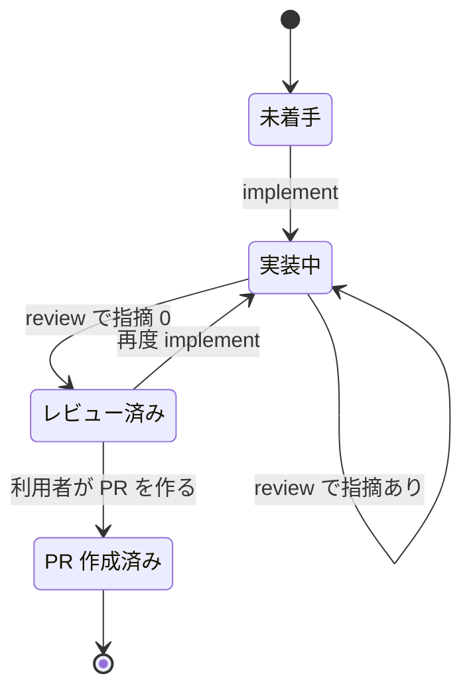

# Design Doc: Specramo v0.1 (merge 後に Claude Code 利用者が plugin を追加するだけで sdd 系の開発手順を使える)

| 項目          | 値                                                                                               |
| ------------- | ------------------------------------------------------------------------------------------------ |
| Status        | draft                                                                                            |
| Created       | 2026-09-27                                                                                       |
| Last Updated  | 2026-09-27                                                                                       |
| Related PRD   | [Specramo PRD (plugin 版)](https://claude.ai/code/artifact/0cbf237b-a379-4234-8af3-1dae0ac5b7f2) |
| Related Issue | なし                                                                                             |

> **正本の注記** (後から修正するときはここに日付付きで書き、本文は書き換えない)
>
> なし

---

## 1. Overview

- PRD 「概要」 のとおり、Claude Code の利用者が Specramo の plugin を追加し、自分の repo で PRD から Phase ごとの PR までを同じ手順で進められるようにする。PRD から変えた点は無い
- この Design Doc で決める範囲は次の 4 つとする
  - plugin に含める skill・エージェント・検査 script・雛形と、それぞれの置き場所
  - 導入先の repo に置く file と、その設定項目
  - `/specramo:review` がどのエージェントをどの条件で起動するか
  - ai-tools にしか無い仕組みへの依存を、どの仕組みに置き換えるか

---

## 2. Glossary

PRD にある語 (Phase / 作業計画書 / Design Doc) は再定義しない。

| 用語             | 説明                                                                                                                                                         |
| ---------------- | ------------------------------------------------------------------------------------------------------------------------------------------------------------ |
| plugin           | Claude Code に skill・エージェント・file をまとめて追加する配布単位。Specramo は 1 つの plugin として配る                                                    |
| marketplace      | plugin の配布元。Specramo の配布用 repo が marketplace を兼ねる                                                                                              |
| skill            | plugin に含める 1 つのコマンドの定義。利用者は `/specramo:<名前>` の形で呼ぶ                                                                                 |
| 導入先           | Specramo を使う利用者の repo                                                                                                                                 |
| 成果物の置き場所 | 導入先で PRD・Design Doc・作業計画書・Phase 詳細設計を置く dir。何も指定しないときは機能ごとの dir                                                           |
| 検査 script      | Design Doc と作業計画書を検査し、PASS / FAIL / WARN を 1 行ずつ出す bash script                                                                              |
| 指摘データ       | チームが過去の PR で受けたレビュー指摘の傾向をまとめた file 群。社内情報を含むので repo に置かない                                                           |
| Phase の状態     | 作業計画書の Phase 表に記録する進み具合。未着手・実装中・レビュー済み・PR 作成済みの 4 つ                                                                    |
| ゲート           | PRD 「リリース計画」 の段階の間に置く条件。v0.2 のゲートは「他のメンバーが説明できる状態で PR を出せた」、v0.3 のゲートは「社内用語の検索 0 件と商標の確認」 |
| review-member    | チームの指摘傾向でレビューする ai-tools の skill                                                                                                             |
| 汎用 12 観点     | ai-tools の comprehensive-review skill に定義された 12 のレビュー観点 (設計・品質・セキュリティ・テストなど)                                                 |

---

## 3. Current State

### 3.1 現状スナップショット (ai-tools main、2026-09-27)

| 項目                        | 状態                                                                                                                                                          |
| --------------------------- | ------------------------------------------------------------------------------------------------------------------------------------------------------------- |
| 移植元の command            | 7 本、合計 897 行 (`/prd` と sdd 系 5 本と `/explain`)                                                                                                        |
| command が直接参照する file | 32 件 (guidelines 8、references 12、rules 5、scripts 4、skills 3)。参照先がさらに参照する file は未計測                                                       |
| 個人の環境にしか無い参照先  | 3 種類。個人の memory と plans の置き場、repo 規約の対応表 (jq が必要)、指摘データの置き場                                                                    |
| 独立した雛形 file           | 2 つ (Design Doc と作業計画書)。PRD と Phase 詳細設計の雛形は command 本文に埋め込まれている                                                                  |
| 検査 script                 | 2 本。Design Doc 用は 115 行で awk だけを使う。作業計画書用は 218 行で、node がある環境だけ図の幅を検査する                                                   |
| 検査 script のテスト        | 2 本とも bats のテストがある                                                                                                                                  |
| 現行の review の担当        | 4 エージェント。A 汎用 12 観点と Phase 固有の観点 / B チームの指摘傾向 / C guideline 全部 / D repo の規約 (A〜C は常に起動し、D は規約があるときだけ起動する) |
| 言語ごとの開発指針          | 13 file。Go が 5 file、TypeScript が 1 file                                                                                                                   |

### 3.4 参考にした既存実装

- ai-tools の sdd 系 command。手順と判定表を移植し、ai-tools にしか無い参照先を置き換える。review の担当、Phase の状態、explain の記録は変更する (決定 6・7・10)
- 2026-09-12 の「Claude Code 設定の公開」Design Doc。公開前に社内用語を検索して止める仕組みを、v0.3 のゲートで同じ形にする
- `review-member` skill (チームの指摘傾向でレビューする ai-tools の skill)。指摘データの場所を環境変数で指定し、無ければ照合を省いて 1 行報告する方式を、エージェント B にそのまま使う

---

## 4. Implementation Surface

合計: API 0 本 (Read 0 / Write 0)、画面 0、DB 変更なし、skill 9、エージェント 4、検査 script 2、雛形 4、導入先の file 2

### Skills

| skill                    | 変更 (新規 / 移植)             | 主な責務                                                 |
| ------------------------ | ------------------------------ | -------------------------------------------------------- |
| `/specramo:init`         | 新規                           | 導入先に設定 file と成果物の置き場所を作る               |
| `/specramo:prd`          | 移植 (`/prd`)                  | PRD を作る                                               |
| `/specramo:design`       | 移植 (`/sdd-design`)           | Design Doc を作り、検査 script で確かめる                |
| `/specramo:plan`         | 移植 (`/sdd-plan`)             | 作業計画書を作り、検査 script で確かめる                 |
| `/specramo:phase-design` | 移植 (`/sdd-phase-design`)     | 選択肢がある Phase の詳細設計を作る                      |
| `/specramo:explain`      | 移植 + 変更 (`/explain`)       | Phase の設計か差分を説明し、実行日を作業計画書に記録する |
| `/specramo:implement`    | 移植 + 変更 (`/sdd-implement`) | Phase を 1 つ実装し、Phase の状態を進める                |
| `/specramo:review`       | 移植 + 変更 (`/sdd-review`)    | エージェント A〜D を並列に起動し、指摘をまとめる         |
| `/specramo:status`       | 新規                           | 機能ごとに Phase の状態と plugin の version を表示する   |

### Agents

| エージェント     | 変更 (新規 / 移植)     | 観点                                     | 起動条件               |
| ---------------- | ---------------------- | ---------------------------------------- | ---------------------- |
| A 設計書との比較 | 移植 + 再構成 (現行 A) | Phase の範囲、受け入れ条件、汎用 12 観点 | 常に                   |
| B 過去の指摘     | 移植 + 変更 (現行 B)   | チームが過去に受けた指摘の傾向           | 指摘データがあるとき   |
| C repo の規約    | 移植 (現行 D)          | 導入先の repo の規約                     | 規約の file があるとき |
| D 言語の開発指針 | 移植 + 変更 (現行 C)   | 言語やフレームワークの開発指針           | 常に                   |

### Scripts

| script          | 変更 (新規 / 移植) | 判定                                                                                                           |
| --------------- | ------------------ | -------------------------------------------------------------------------------------------------------------- |
| Design Doc 検査 | 移植               | Implementation Surface の合計と表の行数の一致、未確定事項の残り、決定の表の cell の長さ、曖昧な形容など 6 項目 |
| 作業計画書検査  | 移植               | PR ごとの想定行数、上限超えの理由、実装方法の混入                                                              |

### Templates

| 雛形           | 変更 (新規 / 移植) | 元                                                                           |
| -------------- | ------------------ | ---------------------------------------------------------------------------- |
| PRD            | 分離               | `/prd` の本文に埋め込まれた出力の形                                          |
| Design Doc     | 移植               | spec 型 Design Doc の template (`design-doc-spec-template.md`)               |
| 作業計画書     | 移植               | 作業計画書の骨格 (`sdd-plan-skeleton.md`。repo に template が無いときに使う) |
| Phase 詳細設計 | 分離               | `/sdd-phase-design` の本文に埋め込まれた出力の形                             |

### 導入先の file

| file                   | 変更 (新規 / 移植) | 用途                                                         |
| ---------------------- | ------------------ | ------------------------------------------------------------ |
| `.specramo/config.yml` | 新規               | 導入先ごとの設定 (下の表)                                    |
| 成果物の置き場所       | 新規               | 機能ごとに PRD・Design Doc・作業計画書・Phase 詳細設計を置く |

`config.yml` の設定項目:

| 項目             | 初期値            | 用途                                                                                            |
| ---------------- | ----------------- | ----------------------------------------------------------------------------------------------- |
| `specs_dir`      | `.specramo/specs` | 成果物の置き場所                                                                                |
| `max_lines`      | 400               | 1 PR の想定変更行数の上限                                                                       |
| `test_paths`     | なし              | 変更行数から除くテスト file の path pattern                                                     |
| `branch_pattern` | なし              | Phase の branch 名の形                                                                          |
| `rules`          | なし              | エージェント C が読む規約 file の path (repo 内の相対 path)。未記入なら `.claude/rules/` を読む |

### 利用者の環境

| 項目                                | 初期値                            | 用途                                  |
| ----------------------------------- | --------------------------------- | ------------------------------------- |
| 環境変数 `SPECRAMO_REVIEW_DATA_DIR` | `~/.config/specramo/review-data/` | エージェント B が読む指摘データの場所 |

### Data Schema

DB 変更なし。

---

## 5. Acceptance Criteria

PRD 「成功指標と受け入れ条件」 の受け入れ条件 (v0.1) は全て満たす。

### 5.1 PRD に書き戻す要件

なし。PRD の非機能要件 (指摘データを環境変数か手元の設定 dir で指定する) と AI レビューの担当表は、この Design Doc の決定と一致している。

### 5.2 Design Doc で決める境界

| No  | 条件                                                                                                                                         | 境界・失敗時                                                                   |
| --- | -------------------------------------------------------------------------------------------------------------------------------------------- | ------------------------------------------------------------------------------ |
| 1   | 設定 file がすでにある repo で利用者が init を実行すると、init は既存の file を変更せず、作らなかった file の名前を表示する                  | 設定 file が無く成果物の置き場所だけがあるときは、設定 file だけを作る         |
| 2   | 設定 file が無い repo で利用者が init 以外のコマンドを実行すると、コマンドは成果物を作らずに init の実行を案内して終了する                   | 設定 file の書式が読めないときも成果物を作らず、読めない行を表示して終了する   |
| 3   | 導入先の雛形の dir に plugin の雛形と同じ名前の file があるとき、各コマンドは導入先の file を雛形として使う                                  | 同じ名前の file が無い雛形は plugin の雛形を使う                               |
| 4   | 指摘データの場所に file が 1 つも無いとき、review はエージェント B を起動せず、B を省いたことを 1 行表示し、A・C・D の結果で完了する         | 環境変数が指す dir が存在しないときも同じ動作にする                            |
| 5   | 設定 file の規約の path が 1 つも存在しないとき、review はエージェント C を起動せず、存在しない path を警告として表示する                    | 規約の path が未記入で repo に規約の dir も無いときは、警告を出さずに C を省く |
| 6   | 作業計画書が無い機能について利用者が status を実行すると、status は plan コマンドの実行を案内する                                            | 作業計画書があるときは、Phase ごとの状態と plugin の version を表示する        |
| 7   | implement と review は、作業計画書の Phase 表の状態列を書き換え、Phase の状態を 6.2 の遷移のとおりに進める                                   | review で Critical か Warning が 1 件以上あったときは、状態を実装中に戻す      |
| 8   | 利用者が Phase の差分に対して explain を実行すると、explain は作業計画書の Phase 表の説明列に実行日を記録する                                | 同じ Phase で再度実行したときは実行日を上書きする                              |
| 9   | 利用者が配布用 repo を clone して検査 script に file path を渡すと、script は Claude Code 無しで判定を出し、FAIL があれば終了コード 1 を返す | node が無い環境では作業計画書の図の幅の検査だけを省き、他の判定は出す          |

---

## 6. Proposed Design

### 6.1 review がエージェントを起動する手順

1. review は作業計画書から対象の Phase を特定し、Phase の差分を取得する
2. review はエージェント A と D を必ず起動対象にする
3. 環境変数 (未設定なら初期値の dir) が指す指摘データの場所に file が 1 つ以上あれば、B を起動対象に加える。無ければ B を省いたことを 1 行表示する
4. 設定 file に規約の path があれば、存在する path だけを C に渡して起動対象に加える。存在しない path は警告として表示する
5. 設定 file に規約の path が無く、repo に規約の dir があれば、その dir の file を C に渡す。どちらも無ければ警告を表示せずに C を省く
6. review は起動対象のエージェントを並列に起動し、各エージェントは他のエージェントの結果を見ずに指摘を返す
7. review は指摘をまとめて表示し、Critical と Warning の合計で Phase の状態を決める (6.2)

### 6.2 Phase の状態

- 状態は作業計画書の Phase 表の状態列だけに記録する。状態列を書き換えるのは implement・review・status の 3 つで、説明列を書き換えるのは explain だけとする
- レビュー済みから PR 作成済みへの遷移は、status が実行時に Phase の branch の PR の有無を GitHub に問い合わせ、PR があれば状態列を書き換える。PR を作るのは利用者で、Specramo は PR を作らない

---

## 7. Design Decisions

### 決定 1: 1 コマンドを 1 skill として作る

- 決定: plugin の各コマンドは skill として作り、利用者は plugin 名を前に付けた名前で呼ぶ (呼び出し名は Implementation Surface の Skills の表)
- 理由: Claude Code の公式 docs (plugin components、2026-09-27 確認) が、新しく作る plugin には旧形式のコマンドの dir より skill を推奨している
- 却下した案: 旧形式のコマンドの dir に置く。呼び出し名は同じになるが、推奨されない形式を新しく作ることになる
- 受け入れる制約: 呼び出し名に plugin 名が付くので、ai-tools の sdd 系より入力が長くなる

### 決定 2: 検査 script と雛形は plugin の中にだけ置く

- 決定: 検査 script と雛形は plugin の中に置き、init は導入先へコピーしない。導入先の雛形の dir に同じ名前の file があれば、そちらを優先する
- 理由: plugin を更新しても導入先の file が変わらないので、PRD が求めた「upgrade で利用者の変更を保つ」仕組みを作らずに済む
- 却下した案: init で導入先へコピーする。更新のたびに利用者の変更と plugin の変更を突き合わせる仕組みが必要になる
- 受け入れる制約: CI から検査 script を使うときは、配布用 repo を clone する

### 決定 3: 成果物の置き場所は設定で変えられる

- 決定: 初期値は Specramo 用の dir の下に機能ごとの dir を作る形とし、設定 file の項目で変えられる (初期値は Implementation Surface の設定項目の表)
- 理由: repo ごとに設計文書の dir が決まっていることがあり、1 つの場所に固定するとその構成とぶつかる
- 却下した案: 固定の場所にする

### 決定 4: 指摘データの場所は環境変数で指定する

- 決定: 環境変数で指定し、未設定なら利用者の設定 dir の中の初期値の場所を参照する (名前と初期値は Implementation Surface の利用者の環境の表)
- 理由: 設定 file は commit されるので、個人の path を記載すると repo に含まれる
- 却下した案: 設定 file に記載する
- 先例: `review-member` が同じ方式 (環境変数、未設定なら手元の初期値の dir)

### 決定 5: 規約の場所は設定 file に並べ、無ければ repo の規約の dir を探す

- 決定: エージェント C は、設定 file の規約の項目に並べた file を読む。未記入なら repo の Claude Code 用の規約の dir の file を読む
- 理由: ai-tools の規約の対応表は個人の環境にしか無く、読むのに jq も必要になる
- 却下した案: ai-tools の対応表をそのまま使う

### 決定 6: review の担当を PRD の A〜D に合わせて再構成する

- 決定: A 設計書との比較 / B 過去の指摘 / C repo の規約 / D 言語の開発指針 の 4 つにする。現行の汎用 12 観点は A に、guideline 全部は D にまとめる
- 現行との対応: 現行 A → 新 A、現行 B → 新 B、現行 C → 新 D、現行 D → 新 C。記号は PRD の担当表に合わせた
- 理由
  1. A: 現行 A の Phase 固有の観点は設計書との比較そのものなので、汎用 12 観点とあわせて A にまとめる
  2. B: 観点は現行と同じ。現行は指摘データが無くても起動してから照合を省くが、結果が空になるエージェントは起動しないように変える
  3. C: 現行 D (repo の規範) と同じ観点と起動条件で、記号だけを変える
  4. D: 現行 C は ai-tools の guideline 全体を読むが、Specramo は同梱する言語の開発指針だけを読むように範囲を限定する
- 却下した案: 現行の担当分けのまま移植する。現行 C が同梱しない guideline を読みに行き、導入先では読めない file が発生する

### 決定 7: Phase の状態は作業計画書の表に記録する

- 決定: 作業計画書の Phase 表に状態列と説明列を設け、各コマンドが書き換える。status はこの表だけを読む
- 現行との差: 状態列と説明列は新しく設ける。現行の sdd 系は完了報告の有無で次の Phase を判定しており、状態列は無い
- 理由: 状態を作業計画書と別の file で管理すると、2 か所の食い違いが起きる
- 却下した案: 状態専用の file を導入先に置く

### 決定 8: ai-tools にしか無い仕組みへの依存を削除する

- 決定: 個人の memory への保存、plans の置き場、Serena (コード解析用の MCP server) の必須化、実装エージェントへの委譲をやめる。Serena は導入先で使えるときだけ使う
- 理由: どれも利用者の環境には無い。memory と plans の置き場を参照する手順は実行できず、Serena を前提にした手順は毎回 grep での代替が必要になる
- 却下した案: 導入時に同等の仕組みを利用者に用意してもらう。導入の手順が増え、PRD の「plugin を追加して init だけで使える」を満たせない

### 決定 9: Design Doc 検査は Web サービス前提のまま同梱する

- 決定: Design Doc 検査の Implementation Surface の判定 (API・画面・DB の表と合計の一致) は変えずに同梱する
- 理由: 想定ユーザーはバックエンドエンジニアで、API と DB の変更を表で数える判定が開発対象と合う。画面の変更が無い開発では「画面 0」と記載すれば済む
- 却下した案: 判定を汎用にする。v0.1 のゲート (PRD の受け入れ条件 (v0.1) を満たす) に判定の汎用化は含まれない
- 受け入れる制約: Web サービス以外の開発では、API 0 本・画面 0 と記載して判定を PASS にする。この Design Doc 自体で、その記載で合計の判定が PASS になることを確認した

### 決定 10: explain は実行日だけを作業計画書に記録する

- 決定: explain は説明を表示した後、作業計画書の Phase 表の説明列に実行日を記録する
- 現行との差: 現行の explain は file を編集しない read-only のコマンドで、この記録だけを新しく加える
- 理由: PRD の成功指標「理解の確認」(explain を実行してから出した PR の割合) を status で数えるには、実行の記録が必要になる
- 却下した案: 記録しない (指標を測れない)。別の file に記録する (決定 7 と同じ理由)
- 受け入れる制約: explain が作業計画書を 1 か所だけ書き換えるようになる

---

## 8. Non-Goals

PRD 「目標と非目標」 の非目標に加えて、次のものは初回に作らない。

| 項目                                                | 初回の扱い               | 後から追加するとき                                                                                      |
| --------------------------------------------------- | ------------------------ | ------------------------------------------------------------------------------------------------------- |
| Go と TypeScript 以外の言語の開発指針               | 同梱しない (暫定決定 Q2) | plugin に言語の file を追加すれば D が読む                                                              |
| CI 用の GitHub Action                               | 作らない                 | 配布用 repo の clone で検査 script を直接実行できるので、利用者から要望があれば action の定義を追加する |
| 作業計画書検査の図の幅の判定に使う node の補助 file | 同梱しない               | node の補助 file を plugin に追加すれば判定が有効になる                                                 |

---

## 10. Deployment and Release Plan

- 順序
  1. 配布用 repo を private で作り、plugin として v0.1 を公開する
  2. ai-tools の sdd 系は v0.2 のゲートまで削除しない。この間の改善は Specramo 側にだけ加え、ai-tools 側は変更しない
  3. v0.2 のゲートを満たしたら、ai-tools から sdd 系を削除して plugin を使う (暫定決定 Q1)
- 切替の手段: 新しい plugin なので既存の動きは変わらず、flag は置かない
- 切り戻し: 手順 1〜2 の間は plugin を無効にすれば ai-tools の sdd 系に戻れる。手順 3 の後は ai-tools の削除 commit を revert して戻す

---

## 11. Open Questions

| No  | 事項                                        | 暫定決定                                                                              | 再レビューの条件                                                              | 確認先 |
| --- | ------------------------------------------- | ------------------------------------------------------------------------------------- | ----------------------------------------------------------------------------- | ------ |
| Q1  | ai-tools と Specramo のどちらを正本にするか | 暫定決定: Specramo を正本にし、v0.2 のゲートを満たしたら ai-tools の sdd 系を削除する | ai-tools 側で sdd 系を他の command から呼んでいて、削除できないと分かったとき | 本人   |
| Q2  | 同梱する言語の開発指針                      | 暫定決定: Go と TypeScript                                                            | v0.2 の利用者のチームが他の言語を主に使うと分かったとき                       | 本人   |
| Q3  | 「Claude Code 設定の公開」計画との関係      | 暫定決定: 公開 repo には sdd 系を含めず、Specramo へのリンクだけを置く                | 公開 repo の公開が Specramo より先になったとき                                | 本人   |

---

## Appendix

### A. 実装トラッキング

- 作業計画書: 未作成 (`/sdd-plan` で作る)
- PRD 更新: なし (Section 5.1)

### C. 関連

- [github/spec-kit](https://github.com/github/spec-kit)
- [Claude Code Plugins reference](https://code.claude.com/docs/en/plugins-reference)
- [Host a plugin marketplace](https://code.claude.com/docs/en/plugins/host-marketplace)
- [Claude Code 設定の公開 Design Doc](./2026-09-12_claude-code-config-publish-export.md)
