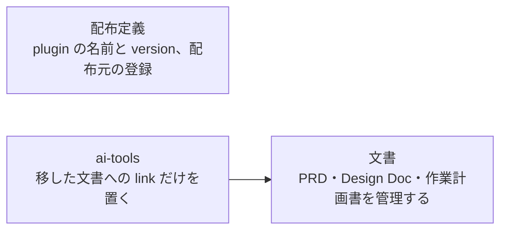
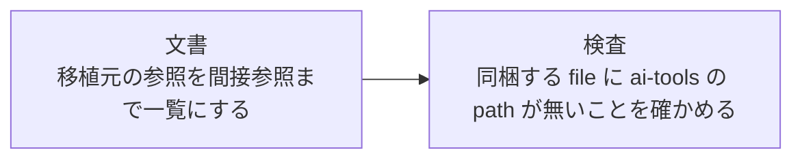
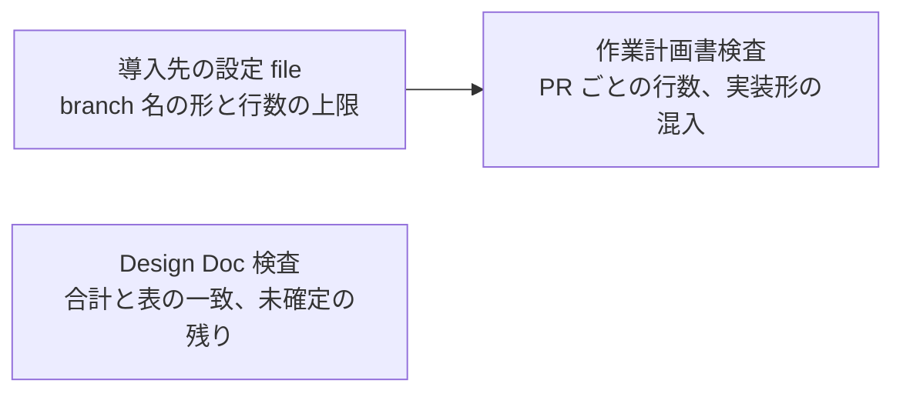
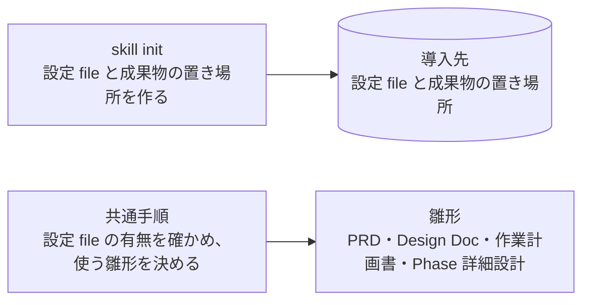
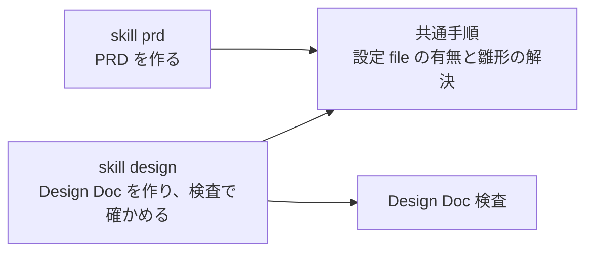
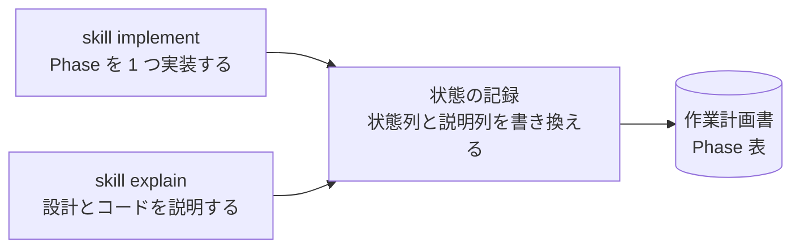
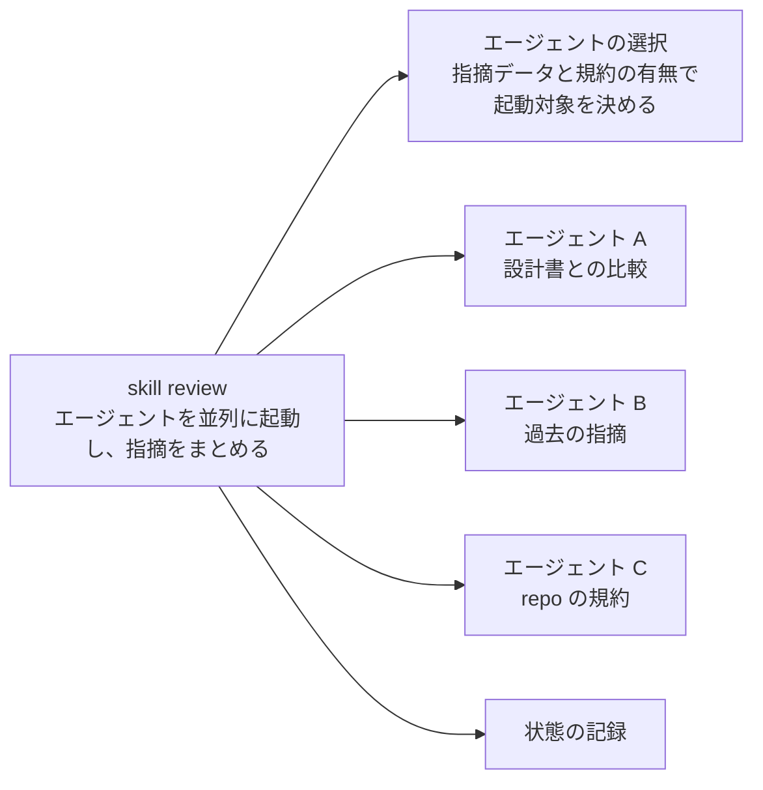
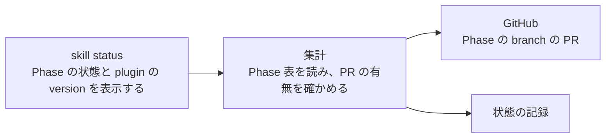
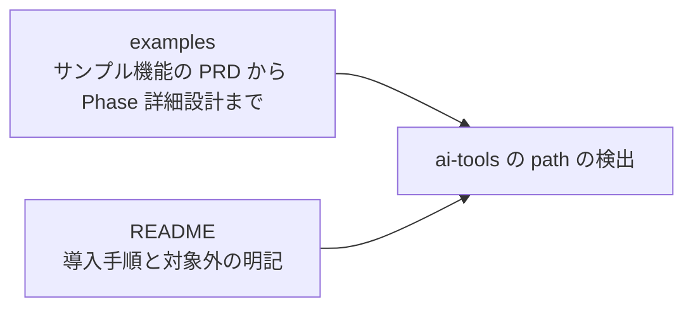
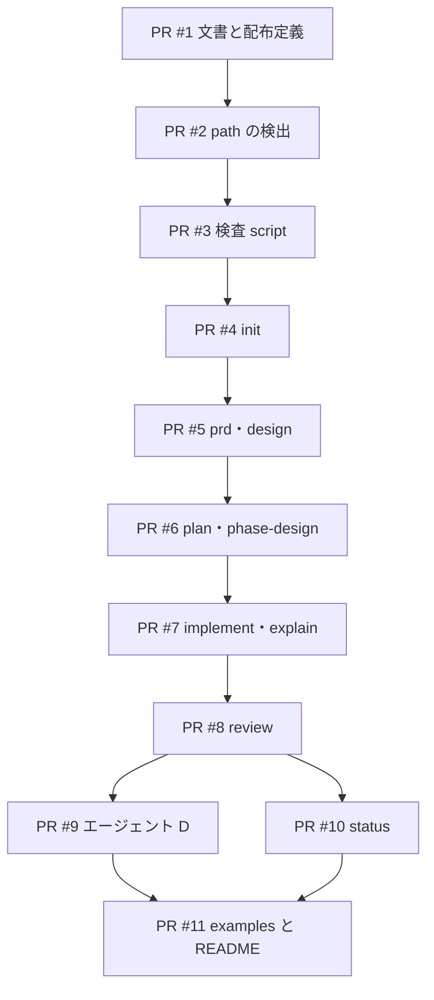

# 作業計画書: Specramo v0.1

- 作成日: 2026-09-27
- PR 数: 11 本 (配布用 repo 10 本、うち PR #1 は ai-tools 側の変更も含む)
- 目安日程: 着手から PR #1 の提出まで 1 日。PR #1〜#3 は文書と検査 script だけで、実装の本体は PR #4 から #11

## この計画書に記載しないこと

1. 他の文書に正本がある内容 (Design Doc の決定と理由、PRD の成功指標)。関連ドキュメントに link だけを置く
2. file path、関数名、script の中身、fixture の構成。`/sdd-phase-design` が Phase ごとに決める
3. 同じ内容の 2 回目以降。各 PR のタスクは対象の図と完了条件の言い換えになるので置かない
4. 決定した日付と経緯

## 関連ドキュメント

- PRD: [Specramo PRD (plugin 版)](https://claude.ai/code/artifact/0cbf237b-a379-4234-8af3-1dae0ac5b7f2)
- Design Doc: [2026-09-27_specramo-design.md](./2026-09-27_specramo-design.md)

## 入口の判定

- Design Doc の完了判定 13 項目: 満たす。未決の Open Questions (Q1〜Q3) は 3 件とも暫定決定があり、作業計画書を止めるものは無い
- Q1 (ai-tools の sdd 系を削除する時期) は v0.2 のゲート以降の作業で、この計画書の対象外
- 領域 memory: この環境に memory の index が無く、引き当てる対象が無い

## 目的

Claude Code の利用者が Specramo の plugin を追加し、`/specramo:init` を実行するだけで、自分の repo で PRD から Phase ごとの PR までを同じ手順で進められるようにする。

## 目的と実装の対応

### 目的A: 利用者が plugin を追加して init だけで使い始められる

文脈: ai-tools の sdd 系は作者の環境にしか無い file を参照しており、他のメンバーが導入できない。

| 分類              | 条件                                                                                                                                                                                                                                                                                                                                                                | 担当 Phase                               |
| ----------------- | ------------------------------------------------------------------------------------------------------------------------------------------------------------------------------------------------------------------------------------------------------------------------------------------------------------------------------------------------------------------- | ---------------------------------------- |
| 導入先の初期化    | No.1 `plugin を追加した空のリポジトリで /specramo:init を実行すると、.specramo/config.yml と .specramo/specs/ が作られる` No.2 `.specramo/ がすでにあるリポジトリで /specramo:init を実行しても、既存の file が変わらない` No.3 `設定 file がすでにある repo で利用者が init を実行すると、init は既存の file を変更せず、作らなかった file の名前を表示する` | PR #4                                    |
| 設定と雛形の解決  | No.4 `設定 file が無い repo で利用者が init 以外のコマンドを実行すると、コマンドは成果物を作らずに init の実行を案内して終了する` No.5 `導入先の雛形の dir に plugin の雛形と同じ名前の file があるとき、各コマンドは導入先の file を雛形として使う`                                                                                                             | PR #5                                    |
| ai-tools への依存 | No.6 `ai-tools にしか無い file（個人の memory、~/.claude/ 配下の script など）を参照する箇所が 0 件である`                                                                                                                                                                                                                                                          | PR #2 (検査を用意)、PR #11 (全体で 0 件) |

### 目的B: 実装者が説明できる状態で Phase ごとに PR を出せる

文脈: AI が書いたコードを実装者が説明できず、レビュワーが先に問題に気づく。

| 分類             | 条件                                                                                                                                                                                                                                    | 担当 Phase                        |
| ---------------- | --------------------------------------------------------------------------------------------------------------------------------------------------------------------------------------------------------------------------------------- | --------------------------------- |
| 通しで進められる | No.7 `examples/ のサンプル機能を、PRD から最後の Phase の PR 作成までコマンドだけで進められる（検証用の GitHub repo を使う）`                                                                                                           | PR #11                            |
| 理解の確認       | No.8 `/specramo:explain を実行すると、Phase の目的・設計判断・変更箇所の説明と、理解を確かめる質問が表示される` No.9 `利用者が Phase の差分に対して explain を実行すると、explain は作業計画書の Phase 表の説明列に実行日を記録する` | PR #7                             |
| Phase の状態     | No.10 `implement と review は、作業計画書の Phase 表の状態列を書き換え、Phase の状態を 6.2 の遷移のとおりに進める`                                                                                                                      | PR #7 (implement)、PR #8 (review) |
| 現在地の表示     | No.11 `作業計画書が無い機能について利用者が status を実行すると、status は plan コマンドの実行を案内する`                                                                                                                               | PR #10                            |

### 目的C: レビューで repo の規約とチームの指摘を観点にできる

文脈: 汎用の観点だけの AI レビューでは、repo 固有の規約やチームが過去に受けた指摘を拾えない。

| 分類             | 条件                                                                                                                                                                                                                                               | 担当 Phase |
| ---------------- | -------------------------------------------------------------------------------------------------------------------------------------------------------------------------------------------------------------------------------------------------- | ---------- |
| 規約の観点       | No.12 `config.yml に規約の場所を書くと、/specramo:review のエージェント C がその規約で指摘を出す` No.13 `設定 file の規約の path が 1 つも存在しないとき、review はエージェント C を起動せず、存在しない path を警告として表示する`             | PR #8      |
| 指摘データの観点 | No.14 `チームの指摘データが無い環境でも、/specramo:review がエージェント B を飛ばして最後まで動く` No.15 `指摘データの場所に file が 1 つも無いとき、review はエージェント B を起動せず、B を省いたことを 1 行表示し、A・C・D の結果で完了する` | PR #8      |

### 目的D: 1 Phase = 1 PR を検査 script で守れる

文脈: 仕様の判断が後回しになり、PR が大きくなる。

| 分類        | 条件                                                                                                                                                                                                                                                                       | 担当 Phase |
| ----------- | -------------------------------------------------------------------------------------------------------------------------------------------------------------------------------------------------------------------------------------------------------------------------- | ---------- |
| 検査 script | No.16 `検査スクリプトが、未確定の項目がある Design Doc と、400 行超の PR を理由なしで含む作業計画書を FAIL にする` No.17 `利用者が配布用 repo を clone して検査 script に file path を渡すと、script は Claude Code 無しで判定を出し、FAIL があれば終了コード 1 を返す` | PR #3      |

条件は PRD の受け入れ条件 (v0.1) 8 件と Design Doc の受け入れ条件 9 件の計 17 件で、全件がいずれかの Phase に割り当てられている。PRD の条件の中の backtick は、引用を囲む記号と重なるので削除した。

## 影響範囲

### Change Map

配布用 repo は新規なので、変更する層はすべて新規作成になる。移植元の ai-tools は PR #1 だけが変更する。

| 層           | 名前                                        | 責務                                                     | 変更     |
| ------------ | ------------------------------------------- | -------------------------------------------------------- | -------- |
| 文書         | 設計文書                                    | PRD・Design Doc・作業計画書を配布用 repo で管理する      | ★ PR #1  |
| 配布定義     | plugin と marketplace の定義                | plugin の名前と version、配布元の登録                    | ★ PR #1  |
| 検査         | ai-tools の path の検出                     | 同梱する file に ai-tools の path が無いことを確かめる   | ★ PR #2  |
| 検査         | Design Doc 検査と作業計画書検査             | 文書の書き方を PASS / FAIL / WARN で判定する             | ★ PR #3  |
| 共通手順     | 前提の確認と雛形の解決                      | 設定 file の有無を確かめ、使う雛形を決める               | ★ PR #4  |
| 雛形         | PRD・Design Doc・作業計画書・Phase 詳細設計 | 各コマンドが成果物を作るときの節構成                     | ★ PR #4  |
| skill        | init                                        | 導入先に設定 file と成果物の置き場所を作る               | ★ PR #4  |
| skill        | prd・design                                 | PRD と Design Doc を作る                                 | ★ PR #5  |
| skill        | plan・phase-design                          | 作業計画書と Phase 詳細設計を作る                        | ★ PR #6  |
| skill        | implement・explain                          | Phase を実装し、設計とコードを説明する                   | ★ PR #7  |
| skill        | review                                      | 起動するエージェントを決めて並列に起動し、指摘をまとめる | ★ PR #8  |
| エージェント | A・B・C                                     | 設計書との比較、過去の指摘、repo の規約                  | ★ PR #8  |
| エージェント | D と言語の開発指針                          | Go と TypeScript の開発指針で指摘する                    | ★ PR #9  |
| skill        | status                                      | Phase の状態と plugin の version を表示する              | ★ PR #10 |
| 文書         | examples と README                          | サンプル機能の成果物一式と導入手順                       | ★ PR #11 |
| 移植元       | ai-tools の sdd 系 command                  | v0.2 のゲートまで変更しない                              | 変更なし |
| 導入先       | 利用者の repo の Claude Code の規約         | エージェント C が読むだけで、Specramo は作らない         | 変更なし |

- repo 規範: 配布用 repo は新規で、規約の対応表に登録が無い。全 Phase で「該当 rule なし」とし、同梱する script の書き方は移植元と同じにする

### 対象ファイル / ディレクトリ

各 PR の対象の図を参照。

### テスト対象

各 PR の完了条件を参照。

### Design Doc との差分

| 項目                                     | 作業計画書での扱い                                                                         | Design Doc へ戻すか                                          |
| ---------------------------------------- | ------------------------------------------------------------------------------------------ | ------------------------------------------------------------ |
| 設計文書を配布用 repo へ移動する作業     | PR #1 として追加した (user の追加要件)                                                     | 戻さない。作業の順序の話で、利用者から見える動きは変わらない |
| ai-tools の path が 0 件であることの検査 | PR #2 で検査を用意し、以後の全 PR の完了条件に含める (user の追加要件)                     | 戻さない。PRD の受け入れ条件に同じ条件がある                 |
| 決定的な処理を script にする方針         | init・状態の記録・エージェントの選択・status の集計を script にする (各 PR の実装への指針) | 戻さない。見える動きは同じで、作り方の決定                   |

## 処理フロー

### 導入

1. ★ 利用者が marketplace を登録し、plugin を追加する — PR #1 で配布定義を用意する
2. ★ 利用者が init を実行し、設定 file と成果物の置き場所を作る — PR #4
3. ★ init 以外のコマンドは、実行のたびに設定 file の有無を確かめ、使う雛形を決める — PR #4 で共通手順を用意し、PR #5 から各コマンドが使う

### 最初に 1 回だけ作る文書

1. ★ prd が PRD を作る — PR #5
2. ★ design が Design Doc を作り、Design Doc 検査で確かめる — PR #5 (検査は PR #3)
3. ★ plan が作業計画書を作り、作業計画書検査で確かめる — PR #6 (検査は PR #3)

### Phase ごとの繰り返し

1. ★ phase-design が選択肢のある Phase の詳細設計を作る — PR #6
2. ★ explain が Phase の設計を説明する — PR #7
3. ★ implement が Phase を実装し、状態列を実装中にする — PR #7
4. ★ review が起動するエージェントを決め、並列に起動し、指摘の数で状態列を進めるか戻す — PR #8 (D は PR #9)
5. ★ explain がコードを説明し、説明列に実行日を記録する — PR #7
6. 利用者が PR を作る (Specramo は PR を作らない)
7. ★ status が Phase の branch の PR の有無を確かめ、状態列を PR 作成済みにして表示する — PR #10

## PR 分割計画

- flag: 使わない (理由: 配布用 repo は新規で利用者がおらず、どの PR の merge も既存の動きを変えないため)
- 行数の数え方: 想定変更行数は、新しく書く行と移植元から書き換える行だけを数える。移植元から内容を変えずにコピーする行は別に「複写」として示し、400 行の点検には含めない。複写の review は、移植元との差分が無いことの確認だけで済むため
- 既存挙動を変えない PR の title に付ける印は、配布用 repo に慣習が無いので付けない
- 切り方: 配布用 repo に慣習が無いので、merge 後に利用者ができることで区切る縦切りを基本にする

### 計画外の PR

実装中に見つかる不具合や、移植元にあった暗黙の前提の補完を見込み、実装 PR の 3 割 (3 本程度) を枠として予約する。

### PR #1: 設計文書を配布用 repo へ移動し、plugin として登録できるようにする

- 依存: なし
- branch: phase/01-docs-and-manifest
- 既存挙動: 変わらない
- 想定変更行数: 70 (根拠: README と LICENSE と配布定義 2 つ。ほかに設計文書 3 本の複写が約 900 行)

**対象**:

**Read/Write**: 新規なし。

**対象外**: skill・エージェント・script は含めない。PRD は Claude Docs から Markdown で書き出したものを複写し、内容は変えない。

**完了条件**:

- 配布用 repo を marketplace として登録し、plugin を追加できる (手動確認: plugin の一覧に specramo が表示される)
- 移した 3 本の文書が移植元と一致する (ai-tools 側の 2 本は差分 0、PRD は書き出した Markdown と差分 0)
- ai-tools の `docs/design/` に、移した 2 本の代わりに移動先への link がある
- 担当条件: なし (配布の土台と文書の移動だけ)

**実装への指針**: ai-tools 側は、main へ直接取り込む ai-tools の作業手順に従う。配布用 repo は private で作成する。

#### 動作確認手順

1. Claude Code で配布用 repo を marketplace として登録する
2. plugin を追加し、エラーが表示されないことを確かめる

### PR #2: ai-tools の path を検出する検査と、移植元の参照一覧を用意する

- 依存: PR #1
- branch: phase/02-dependency-guard
- 既存挙動: 変わらない
- 想定変更行数: 160 (根拠: 参照一覧の文書 120 行と検出の script 40 行)

**対象**:

**Read/Write**: 新規。同梱する file を走査して、ai-tools の path と個人の設定 dir の path を数える責務。

**対象外**: 参照先の file を同梱する作業は、各 skill の PR で行う。

**完了条件**:

- 参照一覧に、移植元 7 command の直接参照 32 件と、その参照先がさらに参照する file が全件あり、各行に「同梱 / 置換 / 削除」の扱いがある
- 検出の script を空の同梱 dir に対して実行すると 0 件で終了コード 0、`~/.claude/` を含む file を 1 つ置くと終了コード 1 になる (bats で確かめる。新規作成)
- 担当する受け入れ条件: `ai-tools にしか無い file（個人の memory、~/.claude/ 配下の script など）を参照する箇所が 0 件である` の検査を用意する (全体で 0 件になるのは PR #11)
- 以後の全 PR は、この検査が 0 件であることを完了条件に含める

**実装への指針**: 検出する語は `~/.claude/`、`$HOME/.claude`、`ai-tools`、個人の非公開設定 dir の名前とする。参照一覧は、この後の PR が同梱の範囲を決めるときの正本にする。

#### 動作確認手順

1. 検出の script を配布用 repo の root で実行し、0 件を確かめる

### PR #3: Design Doc と作業計画書を検査 script で判定できるようにする

- 依存: PR #2
- branch: phase/03-gate-scripts
- 既存挙動: 変わらない
- 想定変更行数: 60 (根拠: 移植元 2 本のうち、規約の対応表から branch 名の形を読む箇所を設定 file から読むように書き換える。ほかに複写が約 280 行)

**対象**:

**Read/Write**: 新規。設定 file から branch 名の形と行数の上限を読む責務。

**対象外**: 図の幅の判定に使う node の補助 file は同梱しない (Design Doc の Non-Goals)。

**完了条件**:

- 移植元の bats test 2 本を移植し、全件 pass する
- `検査スクリプトが、未確定の項目がある Design Doc と、400 行超の PR を理由なしで含む作業計画書を FAIL にする` を bats で確かめる
- `利用者が配布用 repo を clone して検査 script に file path を渡すと、script は Claude Code 無しで判定を出し、FAIL があれば終了コード 1 を返す` を bats で確かめる。node が無い PATH でも、図の幅以外の判定が表示されることを確かめる
- 設定 file の行数の上限を 300 にすると、300 行を超える PR を含む作業計画書が FAIL になる (bats、新規作成)
- PR #2 の検出の script が 0 件

**実装への指針**: 判定の語彙と出力の形は移植元から変えない。変えるのは設定の読み先だけにする。

#### 動作確認手順

1. この作業計画書と Design Doc に 2 本の script を実行し、FAIL 0 を確かめる

### PR #4: 利用者が init で導入先を初期化できるようにする

- 依存: PR #3
- branch: phase/04-init
- 既存挙動: 変わらない
- 想定変更行数: 335 (根拠: init の skill と script 140 行、共通手順 40 行、新しく作る雛形 2 本 90 行、移植する雛形 2 本の書き換え 45 行、設定 file の雛形 20 行。ほかに雛形の複写が約 150 行)

**対象**:

**Read/Write**: 新規。導入先に設定 file と成果物の置き場所を作る責務。既存の file がある場所には作らず、作らなかった file の名前を返す責務。

**対象外**: init 以外の skill は含めない。共通手順を各 skill から使うのは PR #5 から #11。

**完了条件**:

- `plugin を追加した空のリポジトリで /specramo:init を実行すると、.specramo/config.yml と .specramo/specs/ が作られる` を bats で確かめる (init の script を空の dir で実行する)
- `.specramo/ がすでにあるリポジトリで /specramo:init を実行しても、既存の file が変わらない` と `設定 file がすでにある repo で利用者が init を実行すると、init は既存の file を変更せず、作らなかった file の名前を表示する` を bats で確かめる (実行前後の file の hash を比べる)
- 作業計画書の雛形の Phase 表に、状態列と説明列がある
- PR #2 の検出の script が 0 件

**実装への指針**: file を作る処理は script にまとめ、skill はその script を呼んで結果を表示する (bats で確かめられるようにするため)。PRD と Phase 詳細設計の雛形は、移植元の command の本文に埋め込まれた出力の形から作る。

#### 動作確認手順

1. 検証用の空の repo で `/specramo:init` を実行し、2 つが作られることを確かめる
2. もう一度実行し、作らなかった file の名前が表示されることを確かめる

### PR #5: 利用者が PRD と Design Doc を作れるようにする

- 依存: PR #4
- branch: phase/05-prd-design
- 既存挙動: 変わらない
- 想定変更行数: 220 (根拠: 移植元の 2 command 249 行のうち、ai-tools の参照先と memory の手順を書き換える約 130 行と、同梱する書き方の規範の抜粋を再構成する約 90 行。ほかに判断の質の点検表などの複写が約 250 行)

**対象**:

**Read/Write**: 新規なし。PR #4 の共通手順と PR #3 の Design Doc 検査を呼ぶ。

**対象外**: 作業計画書以降の skill。書き方の規範のうち、Design Doc と PRD が参照しない節は同梱しない (参照一覧の扱いに従う)。

**完了条件**:

- `設定 file が無い repo で利用者が init 以外のコマンドを実行すると、コマンドは成果物を作らずに init の実行を案内して終了する` を手動で確かめる (検証用 repo で設定 file を消して prd を実行する)
- `導入先の雛形の dir に plugin の雛形と同じ名前の file があるとき、各コマンドは導入先の file を雛形として使う` を bats で確かめる (雛形を解決する script に、導入先の file がある場合と無い場合を渡す)
- 検証用 repo で design を実行して作った Design Doc に、Design Doc 検査が FAIL 0 を返す
- PR #2 の検出の script が 0 件

**実装への指針**: 雛形の解決は PR #4 の共通手順だけで行い、skill ごとに解決の手順を記載しない。

#### 動作確認手順

1. 検証用 repo で `/specramo:prd` と `/specramo:design` を順に実行する
2. 成果物の置き場所に PRD と Design Doc が作られることを確かめる

### PR #6: 利用者が作業計画書と Phase 詳細設計を作れるようにする

- 依存: PR #5
- branch: phase/06-plan-phase-design
- 既存挙動: 変わらない
- 想定変更行数: 150 (根拠: 移植元の 2 command 279 行のうち、memory の引き当てと規約の対応表の手順を書き換える約 110 行と、同梱する細則の書き換え約 40 行。ほかに細則の複写が約 200 行)

**対象**:

**Read/Write**: 新規なし。PR #3 の作業計画書検査を呼ぶ。

**対象外**: implement 以降の skill。移植元の「領域 memory の引き当て」の手順は削除する (Design Doc の決定 8)。

**完了条件**:

- 検証用 repo で plan を実行して作った作業計画書に、作業計画書検査が FAIL 0 を返し、Phase 表に状態列と説明列がある
- 担当条件: なし (通しの確認は PR #11 の examples で行う)
- PR #2 の検出の script が 0 件

**実装への指針**: 移植元が規約の対応表から読んでいた値 (層の一覧、branch 名の形) は設定 file から読む。設定 file に無い値は「未宣言」として扱い、推測で補わない。

#### 動作確認手順

1. PR #5 で作った Design Doc から `/specramo:plan` を実行する
2. 選択肢のある Phase を 1 つ決めて `/specramo:phase-design` を実行する

### PR #7: 実装者が Phase を実装し、設計とコードの説明を受けられるようにする

- 依存: PR #6
- branch: phase/07-implement-explain
- 既存挙動: 変わらない
- 想定変更行数: 160 (根拠: 移植元の 2 command 264 行のうち、worktree と実装エージェントへの委譲と memory の手順を書き換える約 70 行と、状態列と説明列を書き換える記録の手順 40 行と script 50 行)

**対象**:

**Read/Write**: 新規。作業計画書の Phase 表の状態列と説明列を書き換える責務。

**対象外**: review が状態列を書き換える処理は PR #8。PR 作成済みへの遷移は PR #10。

**完了条件**:

- `/specramo:explain を実行すると、Phase の目的・設計判断・変更箇所の説明と、理解を確かめる質問が表示される` を手動で確かめる
- `利用者が Phase の差分に対して explain を実行すると、explain は作業計画書の Phase 表の説明列に実行日を記録する` を bats で確かめる (記録の script に作業計画書の fixture を渡す。再実行で上書きされることも確かめる)
- `implement と review は、作業計画書の Phase 表の状態列を書き換え、Phase の状態を 6.2 の遷移のとおりに進める` のうち implement の分 (未着手から実装中へ) を bats で確かめる
- PR #2 の検出の script が 0 件

**実装への指針**: 状態列と説明列の書き換えは 1 つの記録の script にまとめ、implement・explain・review・status が共用する。explain は説明列の書き換え以外に file を変更しない。

#### 動作確認手順

1. PR #6 の作業計画書で `/specramo:explain` と `/specramo:implement` を Phase 1 に実行する
2. Phase 表の状態列と説明列が書き換わることを確かめる

### PR #8: レビュワーの観点 A〜C で Phase の差分をレビューできるようにする

- 依存: PR #7
- branch: phase/08-review
- 既存挙動: 変わらない
- 想定変更行数: 260 (根拠: 移植元の review 105 行の書き換え約 80 行、エージェント A〜C の定義 120 行、起動するエージェントを決める script 60 行。ほかに汎用 12 観点の複写が約 130 行)

**対象**:

**Read/Write**: 新規。指摘データの場所と規約の path の有無から、起動するエージェントを決める責務。

**対象外**: エージェント D は PR #9。

**完了条件**:

- `設定 file の規約の path が 1 つも存在しないとき、review はエージェント C を起動せず、存在しない path を警告として表示する` を bats で確かめる (選択の script)
- `指摘データの場所に file が 1 つも無いとき、review はエージェント B を起動せず、B を省いたことを 1 行表示し、A・C・D の結果で完了する` と `チームの指摘データが無い環境でも、/specramo:review がエージェント B を飛ばして最後まで動く` を bats (選択の script) と手動 (検証用 repo で review を最後まで実行) で確かめる
- `config.yml に規約の場所を書くと、/specramo:review のエージェント C がその規約で指摘を出す` を手動で確かめる (規約に 1 つだけ違反した差分を検証用 repo に用意する)
- `implement と review は、作業計画書の Phase 表の状態列を書き換え、Phase の状態を 6.2 の遷移のとおりに進める` のうち review の分 (指摘 0 でレビュー済み、指摘ありで実装中) を bats で確かめる
- PR #2 の検出の script が 0 件

**実装への指針**: 起動の判定は選択の script にまとめ、skill は script の結果に従ってエージェントを起動する。エージェント B の指摘データの場所は環境変数を先に見る (Design Doc の決定 4)。

#### 動作確認手順

1. 指摘データが無い状態で `/specramo:review` を実行し、B を省いた旨の 1 行を確かめる
2. 規約の path を 1 つ設定して再度実行し、C の指摘が表示されることを確かめる

### PR #9: エージェント D が Go と TypeScript の開発指針で指摘できるようにする

- 依存: PR #8
- branch: phase/09-review-agent-d
- 既存挙動: 変わらない
- 想定変更行数: 60 (根拠: エージェント D の定義 40 行と、言語の判定の追加 20 行。ほかに開発指針 6 本の複写が約 1,000 行)

**対象**:

**Read/Write**: 新規なし。

**対象外**: Go と TypeScript 以外の開発指針 (Design Doc の Non-Goals、暫定決定 Q2)。

**完了条件**:

- 同梱した開発指針 6 本が移植元と差分 0
- 検証用 repo の Go の差分に review を実行すると、D の指摘に Go の開発指針の file 名が添えられる (手動確認)
- PR #2 の検出の script が 0 件
- 担当条件: なし (review の条件は PR #8 が担当する)

**実装への指針**: 差分に含まれる言語の開発指針だけを D に渡す。どちらの言語も含まない差分では、D は開発指針なしの汎用の観点で指摘する。

#### 動作確認手順

1. Go の file を含む差分で `/specramo:review` を実行し、D の指摘を確かめる

### PR #10: 利用者が status で Phase の進み具合を確認できるようにする

- 依存: PR #8
- branch: phase/10-status
- 既存挙動: 変わらない
- 想定変更行数: 140 (根拠: status の skill 50 行と、作業計画書の Phase 表を集計して PR の有無を確かめる script 90 行)

**対象**:

**Read/Write**: 新規。作業計画書の Phase 表を機能ごとに集計する責務。Phase の branch の PR の有無を確かめ、PR があれば状態列を PR 作成済みにする責務。

**対象外**: PR の作成 (Specramo は PR を作らない)。

**完了条件**:

- `作業計画書が無い機能について利用者が status を実行すると、status は plan コマンドの実行を案内する` を bats で確かめる (集計の script)
- 作業計画書があるとき、Phase ごとの状態と plugin の version が表示される (bats、PR の有無の確認は stub にする)
- PR #2 の検出の script が 0 件

**実装への指針**: GitHub への問い合わせは集計の script に閉じ、test では stub に差し替えられる形にする。

#### 動作確認手順

1. PR #7 と PR #8 で状態を進めた検証用 repo で `/specramo:status` を実行する

### PR #11: サンプル機能で PRD から最後の PR までを通し、導入手順を公開する

- 依存: PR #9、PR #10
- branch: phase/11-examples-readme
- 既存挙動: 変わらない
- 想定変更行数: 370 (根拠: サンプル機能の成果物一式 250 行と、日本語と英語の README の導入手順 120 行)

**対象**:

**Read/Write**: 新規なし。

**対象外**: 公開 (v0.3 のゲート)、他のメンバーによる利用 (v0.2 のゲート)。

**完了条件**:

- `examples/ のサンプル機能を、PRD から最後の Phase の PR 作成までコマンドだけで進められる（検証用の GitHub repo を使う）` を手動で確かめ、その成果物を examples に置く
- `ai-tools にしか無い file（個人の memory、~/.claude/ 配下の script など）を参照する箇所が 0 件である` を、配布用 repo の全体に PR #2 の検出の script を実行して確かめる
- README に、小さな修正は対象外で直接実装してよいことが明記されている

**実装への指針**: サンプル機能は Phase が 2 つで済む小さな題材にし、examples の行数を抑える。

#### 動作確認手順

1. 検証用の GitHub repo で、examples の手順どおりに init から最後の Phase の PR 作成までを実行する

### マージ順序と依存関係

- PR #9 と PR #10 は互いに依存しないので、並行して進めてよい
- どの PR も新しい repo への追加で、単独で merge しても既存の利用者の動きは変わらない

---

各 Phase は `/sdd-phase-design` で実装方法を決め、`/explain` で設計の説明を受けてから `/sdd-implement` で実装する。実装後は `/sdd-review` で review を受け、`/explain` で code の説明を受けてから PR 作成と次 Phase へ進む。
