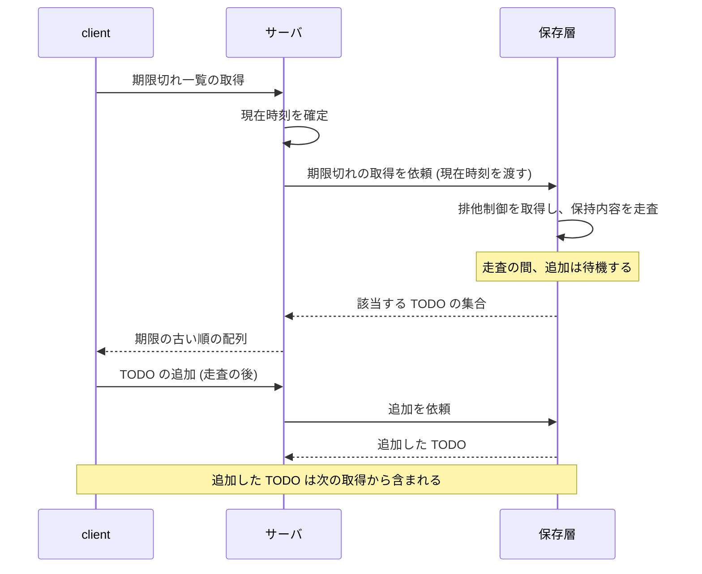

# Design Doc: 期限切れ TODO の一覧 (overdue-todos)

| 項目          | 値              |
| ------------- | --------------- |
| Status        | draft           |
| Created       | 2026-09-27      |
| Last Updated  | 2026-09-27      |
| Related PRD   | [PRD](./prd.md) |
| Related Issue | なし            |

> **正本の注記**
>
> 2026-09-27: 非対話の実行のため、作成者は骨子を利用者に確認せず、推奨のまま本文を作成した。利用者は差分をこの file へ直接記入する。

---

## 1. Overview

- TODO API を呼ぶ client が、期限を過ぎていて完了していない TODO だけを 1 回の request で取得できる状態にする。現状は全件を取得してから client 側で抽出する形になっている。
- 目的と背景と範囲は [PRD](./prd.md) 「1. Overview」 のとおりで、この Design Doc (以下 DD) は PRD から変更していない。
- 採用の判断とその根拠は PRD 「1.5 判断の根拠」 のとおりで、この DD では再評価しない (Source: `.specramo/specs/overdue-todos/prd.md`)。
- この DD で決定する範囲は 3 つある。
  - 期限切れの判定をどの層で行うか。
  - 判定に使う現在時刻をどこで確定し、どう渡すか。
  - 取得の入口を新設するか、既存の一覧に条件の指定を追加するか。
- あわせて、PRD の受け入れ条件に無い境界を 5 つ固定する。
  - 取得と追加が同時に起きたときの応答。
  - 同じ request を続けて送ったときの応答。
  - 期限が同じ TODO どうしの並び。
  - 応答の 1 件の項目の構成。
  - 取得以外の method で送ったときの動作。

---

## 2. Glossary

PRD 「4.5 Formalization」 の用語表 (期限 / 期限なし / 完了済み / 期限切れ / 現在時刻) をそのまま使う。ここに記載するのは PRD に無い語だけとする。

| 分類   | 用語         | 説明                                                                                                                                             |
| ------ | ------------ | ------------------------------------------------------------------------------------------------------------------------------------------------ |
| 操作   | 入口         | client が request を送る宛先と、そこで request を受けてから応答を返すまでのサーバ側の処理。この DD で追加するのは取得の入口 1 つだけとする       |
| 操作   | 期限切れ一覧 | 期限切れの TODO だけを返す新しい取得。含める対象は期限が設定され、完了しておらず、期限が現在時刻より前の TODO とし、期限なしと完了済みは含めない |
| 操作   | 全件一覧     | 既存の取得。保存しているすべての TODO を返す                                                                                                     |
| 行為者 | client       | TODO API を呼ぶ program。認証が無いので client による区別はしない                                                                                |
| 行為者 | サーバ       | API の処理をする側。入口で request を受け、保存層へ取得を依頼し、応答を返す                                                                      |
| 行為者 | 保存層       | TODO をメモリ上に保持する部分。保持内容の読み書きを排他制御で保護する                                                                            |
| 状態   | 走査時点     | 保存層が一覧を組み立てるために、保持内容を 1 度だけ読む時点                                                                                      |

---

## 3. Current State

### 3.1 現状スナップショット (branch master、2026-09-27)

| 項目                     | 状態                                                                             |
| ------------------------ | -------------------------------------------------------------------------------- |
| 公開している取得の入口   | 1 本 (全件一覧だけ)                                                              |
| 期限による抽出の手段     | 無い                                                                             |
| 外部 library の依存      | 0 件 (標準 library だけで動作する)                                               |
| 対象の package の file   | 4 件 (うち test 1 件)                                                            |
| 全件一覧の応答           | 保存した順のまま全件を返す。順序を仕様として定めた記述は無い                     |
| 全件一覧の読み取りの方式 | 排他制御の中で保持内容を全件複製してから返す。返す件数を条件で限定する手段は無い |
| 全件一覧の失敗時の応答   | 無い。入力を受け取らないので入力の検査も無い                                     |
| 保存の方式               | メモリ上の集合を排他制御で保護する。件数の上限は決まっていない                   |
| 現在時刻を使う判定       | 無い。TODO は期限の日時を保持するが、時刻を比較する処理は無い                    |

### 3.2 参考にした既存実装

- 全件一覧の入口を参考にする。期限切れ一覧の入口を同じ形 (同じ Content-Type で JSON の配列を返す) でその隣に追加する。
- 保存層の一覧の読み取りを参考にする。排他制御の取り方を合わせ、期限切れの判定もその保護の中で実行する。
- 全件一覧の test を参考にする。境界の確認を同じ形式 (HTTP の request を組んで応答を確認する) で追加する。

---

## 4. Implementation Surface

合計: API 変更 1 本 (Read 1 / Write 0)、Read の能力 1、Write の能力 0、画面 0、DB 変更なし。

ここでの「能力」は、保存層が入口へ提供する読み書きの操作を 1 件と数えたものとする。入口の数とは別に数える。

### Backend API

| endpoint             | 種別 (Read / Write) | 変更 (新規 / 既存拡張) | 主な責務                                                                        |
| -------------------- | ------------------- | ---------------------- | ------------------------------------------------------------------------------- |
| `GET /todos/overdue` | Read                | 新規                   | 現在時刻を 1 度確定し、期限切れの TODO を期限の古い順に並べて JSON の配列で返す |

既存の `GET /todos` は route 定義を確認したうえで変更しない。現状の route 定義は 1 本だけで、`GET /todos/overdue` は存在しない。

### Required Read Capabilities

| Read                   | 新規 / 既存 | 用途                                                                                                                |
| ---------------------- | ----------- | ------------------------------------------------------------------------------------------------------------------- |
| 期限切れの TODO の取得 | 新規        | 渡された現在時刻で 3 条件 (期限あり / 完了していない / 期限が現在時刻より前) を適用し、該当する TODO だけを収集する |

### Required Write Capabilities

Write の能力は増えない。この変更は読み取りだけで、保存する内容を変更しない。

### Data Schema

DB 変更なし。保存はメモリ上の集合のままで、保持する項目も増えない。

---

## 5. Acceptance Criteria

[PRD](./prd.md) 「6. Acceptance Criteria」 の 9 条件は全て満たす。ここに記載するのは PRD に無い条件だけとする。表の先頭の `No` は読みやすさのための通し番号で、後続のステップからは条件の文で参照する。

### 5.1 PRD に書き戻す要件

書き戻す要件は無い。この DD は PRD の要件を変更していない。期限ちょうどを含めない扱いと並び順と該当 0 件のときの応答は、いずれも PRD の決定のまま採用した。

### 5.2 DD で決定する境界

| No  | 条件                                                                                                                                                 | 境界と失敗時                                                                                                                                                |
| --- | ---------------------------------------------------------------------------------------------------------------------------------------------------- | ----------------------------------------------------------------------------------------------------------------------------------------------------------- |
| 1   | client が期限切れ一覧を取得している間にサーバが TODO を追加したとき、その応答は走査時点の内容になり、追加した TODO を含めない                        | 追加が走査より前に完了していれば、その TODO は同じ応答に含まれる。取得と追加が重なっても、どちらも失敗しない                                                |
| 2   | client が同じ期限切れ一覧の request を続けて 2 回送り、その間に保存内容も期限と現在時刻の関係も変わらないとき、2 回目の応答は 1 回目と同じ内容になる | 期限切れ一覧の取得は保存内容を変更しない。2 回の request の間に期限が現在時刻より前になった TODO があれば、2 回目の応答はその TODO を含む                   |
| 3   | 期限が同じ期限切れの TODO が複数あるとき、応答にはその全件が含まれる                                                                                 | 期限が同じ TODO の間の順序は決めない。client はその順序に依存できない                                                                                       |
| 4   | client が期限切れ一覧を取得したとき、応答の 1 件は全件一覧の 1 件と同じ 4 つの項目で構成される                                                       | 期限切れ一覧は期限なしを含めないので、期限の項目にゼロ値の日時が現れることはない。全件一覧では期限なしの 1 件も期限の項目を含み、そこにゼロ値の日時が現れる |
| 5   | client が期限切れ一覧の path へ、取得と同じ扱いにならない method で request を送ったとき、一覧は返らず、request は受け付けられない                   | HEAD は取得と同じ扱いになり、受け付けられる。応答の形は [Appendix B](#b-api-リファレンス) に記載する                                                        |

---

## 6. Proposed Design (Data Flow)

### 6.1 期限切れ一覧を返すまでの順序

1. client が期限切れ一覧の取得を送る。入力は path だけで、条件の指定は受け取らない。
2. サーバが現在時刻を 1 度だけ確定する。この後の処理では時刻を再取得しない。
3. サーバが確定した現在時刻を渡して、保存層に期限切れの TODO の取得を依頼する。
4. 保存層が排他制御の中で保持内容を 1 度走査し、3 条件を満たす TODO だけを収集して返す。走査の間、保持内容は変わらない。
5. サーバが収集した TODO を期限の古い順に並べ、JSON の配列として返す。該当が 0 件なら空の配列を返す。

### 6.2 同時実行: 取得と追加が重なる場面

取得と追加が同時に到着しても、走査は排他制御の中で実行されるので、応答が走査の途中の状態を返す場面は発生しない。走査の後に完了した追加は、その request の応答には含まれない。

---

## 7. Design Decisions

### 決定 1: 判定の置き場

- **決定**: 期限切れの判定は保存層の取得 1 つで実行する。入口は条件を組み立てず、受け取った TODO を期限の古い順に並べて返す。
- **理由**:
  1. 期限切れの定義を 1 箇所へ固定でき、判定を変更するときの変更箇所が 1 つになる。
  2. 全件一覧の読み取りは保持内容を全件複製するので、入口で抽出すると、返す件数と無関係な複製が毎回発生する。
- **却下した案**: 入口が全件一覧を取得してから抽出する案。返す件数が 1 件でも全件を複製する。
- **受け入れる制約**: 保存層が判定の条件を保持する。判定を変更するときは保存層側を、並び順を変更するときは入口側を変更する。
- **先例**: 保存層に読み取りを配置する形 1 件 (全件一覧)、入口側で抽出する形 0 件。多数派に合わせた。

### 決定 2: 判定に使う現在時刻の渡し方

- **決定**: 判定に使う現在時刻は入口で 1 度確定し、取得の入力として保存層へ渡す。
- **理由**:
  1. 期限ちょうどの境界を test で固定でき、境界の不具合を実装の段階で確認できる。
  2. 走査の途中で時刻が進んでも、判定の基準が request の中で変わらない。
- **却下した案**: 保存層の内部で時刻を取得する案。期限ちょうどの境界を test で固定できない。
- **受け入れる制約**: 呼び出し側が時刻を渡す。渡さなかった場合は判定の基準が決まらない。
- **先例**: 現在時刻を使う処理 0 件。先例が無いため、境界を test で固定できるかどうかを採用の基準にした。

### 決定 3: 取得の入口の形

- **決定**: 期限切れ一覧は専用の入口を新設し、入力は path だけとする。
- **理由**: 既存の全件一覧の応答の意味を変更せずに、期限切れの定義を API 側へ配置できる。
- **却下した案**: 既存の全件一覧に条件の指定を追加する案と、汎用の条件を渡す仕組みを作る案 (PRD 「1.5 Q3」 の案 B と案 D)。前者は全件一覧の応答の意味が指定によって変わり、後者は条件が 1 つの時点で抽象化する。
- **受け入れる制約**: 期限以外の抽出条件が 1 つ追加される時点で、入口を増やすか条件の指定へ変更するかを判断する。
- **先例**: 取得の入口 1 件 (全件一覧)、条件の指定を解析する入口 0 件。

---

## 8. Non-Goals

PRD 「1.6 Non-Goals」 の 7 件 (ページング / 並び順の指定 / 期限が近い一覧 / 利用者ごとの抽出と認証 / 汎用の抽出機構 / 保存先の変更 / 全件一覧の応答の変更) は対象外のまま変更しない。この DD で追加する対象外は次の 4 件とする。

| 項目                         | 初回の扱い                                              | 後から追加するとき                                                                       |
| ---------------------------- | ------------------------------------------------------- | ---------------------------------------------------------------------------------------- |
| 期限切れの件数だけを返す手段 | 作らない。件数は一覧を取得した client が数える          | 同じ判定を使う別の入口を追加する。判定は保存層の 1 箇所を共有する                        |
| 一覧の結果の保持 (cache)     | 作らない。走査は request ごとに毎回実行する             | 一覧の応答時間について client から指摘を受けた時点で、保持の期間と無効化の条件を決定する |
| 期限切れの通知               | 作らない。client が取得を送ったときだけ判定する         | 判定を呼ぶ別の処理として追加する。判定の条件は変更しない                                 |
| 取得の log と metrics        | 追加しない。repo に log と metrics の仕組みが存在しない | 仕組みを導入するときに、この入口も対象へ含める                                           |

---

## 10. Deployment and Release Plan

- 順序: 期限切れの判定と新しい入口と test を 1 つの変更として公開用の branch (現在は master) へ merge する。段が 1 つなので flowchart は置かない。
- なぜ分割しないか: 判定だけを先に merge しても client から呼ぶ経路が無く、入口だけを先に merge すると判定の無い応答を返すことになる。
- 実質のリリース時点: 公開用の branch へ merge した時点。既存の全件一覧の path と応答と Content-Type は変わらない。
- 切替の手段: flag を使わない。追加するのは新しい path だけで、既存の client に見える変化が無いため、有効と無効を切り替える対象が存在しない。既存の動作が変わる変更は 0 本なので、flag の置き場所の検討も不要とする。
- 切り戻し: 新しい入口の削除で元の状態に戻る。保存する内容を変更しないので、戻せなくなる点は無い。

---

## 11. Open Questions

| No  | 事項                                           | 影響                                                                                                               | 決める時点                       | 確認先       |
| --- | ---------------------------------------------- | ------------------------------------------------------------------------------------------------------------------ | -------------------------------- | ------------ |
| Q1  | 期限切れ一覧を使う client の数を確認していない | client が 1 つだけなら、判定を API 側の 1 箇所に配置する効果は小さくなる (PRD 「7. Review Result」 の Info と同じ) | リリース後に利用の状況を確認する | API の利用者 |
| Q2  | 期限の意味が日付単位になる運用があるか         | 日付単位なら現在時刻との比較では境界が一致せず、timezone の決定が必要になる                                        | 日付単位の要望を受け取った時点   | API の利用者 |

---

## 12. Review Points

- 判定を保存層へ配置する決定と、境界 1 (走査時点の内容を返す) の組み合わせ: 走査を排他制御の中で実行するので、走査の間に保持内容が変わる場面は発生しない。この前提が成り立たなくなるのは保存方式が変わったときで、この DD の Q2 (期限の意味が日付単位になるか) とは独立している。
- 境界 2 (再送で同じ内容の応答) と PRD の境界 (期限ちょうどは含めない) の組み合わせ: 2 回の request の間に期限が現在時刻より前になれば応答は変わる。「同じ内容になる」は、保存内容と判定の条件が同じ範囲に限った主張である。

---

## Appendix

### A. 実装トラッキング

| 項目        | 状態                                 |
| ----------- | ------------------------------------ |
| 作業計画書  | 未作成 (`/specramo:plan` で作成する) |
| PRD 更新 PR | 不要 (Section 5.1 の書き戻しが 0 件) |
| 実装 PR     | 未作成                               |

### B. API リファレンス

`GET /todos/overdue` (新規、Read)

| 項目             | 内容                                                                                                                                                                                                                              |
| ---------------- | --------------------------------------------------------------------------------------------------------------------------------------------------------------------------------------------------------------------------------- |
| 要求             | path だけ。query parameter と body は受け取らない                                                                                                                                                                                 |
| 応答 (該当あり)  | TODO の配列。1 件の項目は `id` (整数) / `title` (文字列) / `due` (日時) / `done` (真偽)                                                                                                                                           |
| 応答 (該当 0 件) | 空の配列 `[]` (`null` にしない)                                                                                                                                                                                                   |
| Content-Type     | `application/json`                                                                                                                                                                                                                |
| 期限の項目       | 期限切れ一覧は期限ありに限るので、`due` には実際の期限が現れる。全件一覧では期限なしの 1 件も `due` を含み、そこにゼロ値の日時 `0001-01-01T00:00:00Z` が現れる (`omitempty` は日時の型を省略の対象にしない。`go test` で実測した) |
| HTTP status      | 200: 該当ありと該当 0 件の両方、および `HEAD` で送ったとき。405: `POST` や `DELETE` のように取得と同じ扱いにならない method で送ったとき (route を追加する前は 404)                                                               |

既存の `GET /todos` の要求と応答は変更しない。

### C. 関連

- [PRD: 期限切れ TODO の一覧](./prd.md)
- 次のステップ: `/specramo:plan` で Phase を PR へ分解する。変更する file と関数と test の実装方針は `/specramo:phase-design` で決定する。
