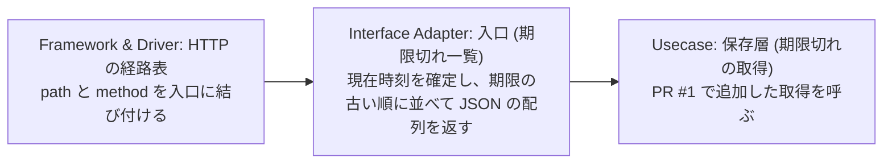

# 作業計画書: 期限切れ TODO の一覧 (overdue-todos)

PR は 2 本。目安の日程は PR #1 が 0.5 日、PR #2 が 0.5 日で、合わせて 1 日とする。

## この計画書に記載しないこと

1. 他の文書に正本がある内容 (Design Doc の決定と境界、PRD の受け入れ条件の本文)。関連ドキュメントの link で参照する
2. file path、method 名、SQL、fixture の構成。`/specramo:phase-design` が Phase ごとに決める
3. 同じ内容の 2 回目以降。1 か所だけに記載し、他の節からは節名で参照する
4. 決定した日付と経緯。理由だけを記載する

## 関連ドキュメント

- Design Doc: [design.md](./design.md)
- PRD: [prd.md](./prd.md)

## 目的

TODO API を呼ぶ client が、期限を過ぎていて完了していない TODO だけを 1 回の request で取得できる状態にする。期限切れかどうかの判定を API 側の 1 箇所に固定し、期限なしと完了済みの扱いをすべての client で一致させる。

## Phase の状態

| PR  | Phase 名                         | 状態   | 説明 |
| --- | -------------------------------- | ------ | ---- |
| #1  | 期限切れの判定を保存層に追加する | 未着手 |      |
| #2  | 期限切れ一覧の入口を追加する     | 未着手 |      |

## 目的と実装の対応 (Phase が 3 つ以上のときだけ)

該当なし。PR は 2 本なので作らない。受け入れ条件と PR の対応は、各 PR の完了条件に記載する。

## 影響範囲

### Change Map

| 層                 | 名前                        | 責務                                                            | 変更     |
| ------------------ | --------------------------- | --------------------------------------------------------------- | -------- |
| Entity             | TODO の型                   | 1 件の項目 (識別子 / 題名 / 期限 / 完了) を保持する             | 変更なし |
| Usecase            | 保存層 (全件一覧の読み取り) | 保持内容を排他制御の中で全件複製して返す                        | 変更なし |
| Usecase            | 保存層 (期限切れの取得)     | 渡された現在時刻で 3 条件を適用し、該当する TODO を収集して返す | ★ PR #1  |
| Interface Adapter  | 入口 (全件一覧)             | 保存した順のまま全件を JSON の配列で返す                        | 変更なし |
| Interface Adapter  | 入口 (期限切れ一覧)         | 現在時刻を 1 度確定し、期限の古い順に並べて JSON の配列で返す   | ★ PR #2  |
| Framework & Driver | HTTP の経路表               | path と method を入口に結び付ける                               | ★ PR #2  |

保存層の 2 行は同じ部品の中の別の責務で、PR #1 で追加するのは期限切れの取得だけとする。全件一覧の読み取りは呼び出し側も含めて変更しない。

### 既存実装の確認

該当なし。Design Doc から入ったため、Step 2 の判定は下の「対象ファイル / ディレクトリ」で行う。

### 対象ファイル / ディレクトリ

対象は package 1 つで、層は 3 つとする。影響ファイル数の見込みは 3 (保存層 1 / 入口 1 / test 1、うち test 1 件は新規作成)。

| 層                | 現状                                                              | 到達の確認                                                      |
| ----------------- | ----------------------------------------------------------------- | --------------------------------------------------------------- |
| Entity            | 期限と完了の項目を保持する型が 1 つある                           | 保存層と入口の両方から参照される                                |
| Usecase           | 保存層に追加と全件一覧の読み取りが 1 つずつある。抽出の手段は無い | 入口から呼ばれる                                                |
| Interface Adapter | 入口を組み立てる処理が 1 つあり、経路の定義は全件一覧の 1 本だけ  | repo 内の呼び出し元は test だけで、実行用の main は repo に無い |

`GET /todos/overdue` の経路は存在しない (経路の定義を実物で確認した)。実行時の配線は repo の外にあるので、動作の確認は test の中の HTTP の記録で行う。

### テスト対象

| 対象                   | 現状                                                     | この計画での扱い           |
| ---------------------- | -------------------------------------------------------- | -------------------------- |
| 入口の全件一覧         | test 1 件が実在する (応答の本文に題名が現れることを確認) | 変更せず、回帰の確認に使う |
| 保存層の期限切れの取得 | 無い                                                     | PR #1 で新規作成する       |
| 入口の期限切れ一覧     | 無い                                                     | PR #2 で新規作成する       |

### Design Doc との差分

1. Design Doc 「10. Deployment and Release Plan」は段を 1 つとし、判定と入口と test を 1 つの変更として merge する計画になっている。この計画書は利用者の指定で 2 本の PR に分けた。PR #1 は呼び出し経路が無いので本番の動作は変わらず、Design Doc が分割しない理由に挙げた「入口だけを先に merge すると判定の無い応答を返す」場面にも当たらない。Design Doc の側を 2 段へそろえるには `/specramo:design --update` が必要になる
2. 受け入れ条件をどの test で確かめるかは Design Doc に記載が無いので、この計画書の完了条件で決めた
3. Design Doc の endpoint と項目と表の不足は無い。応答の項目と HTTP status は Design Doc の Appendix B が正本とする

## 処理フロー

### 期限切れ一覧 (新設)

1. ★ client が期限切れ一覧の取得を送り、経路表がその path を受け付ける — PR #2 で経路を追加する
2. ★ 入口が現在時刻を 1 度だけ確定する。この後は時刻を再取得しない — PR #2
3. ★ 入口が確定した現在時刻を渡して、保存層に期限切れの取得を依頼する — PR #2 (依頼先は PR #1 で追加する)
4. ★ 保存層が排他制御の中で保持内容を 1 度走査し、3 条件 (期限あり / 完了していない / 期限が現在時刻より前) を満たす TODO だけを収集する — PR #1
5. ★ 入口が収集した TODO を期限の古い順に並べ、JSON の配列として返す。該当が 0 件なら空の配列を返す — PR #2

### 全件一覧 (変わらない)

1. client が全件一覧の取得を送る
2. 保存層が排他制御の中で保持内容を全件複製する
3. 入口が複製を保存した順のまま JSON の配列として返す

## PR 分割計画

- flag: 使わない (理由: 追加するのは新しい path だけで、既存の client に見える変化が無く、有効と無効を切り替える対象が存在しない)

分け方は層で切った。この repo は merged PR が 0 本で分け方の慣習を測れないため、判断の材料は利用者の指定と Design Doc の決定にした。縦切りなら 1 本になるところを 2 本にしたので、分割の優先順位 2 (1 PR = 1 目的で小さい) を優先し、優先順位 1 (その PR だけで採否を決められる) は PR #1 の unit test で満たす。層切りの例外条件は 5 つとも満たす。

- 切る面は PR #1 で定義する保存層の取得 1 面で、仮の境界を作らない
- 接続する PR #2 がこの計画書の中で確定している
- PR #1 単体の完了条件を test の実行で判定できる
- PR #1 は受け入れ条件を保持せず、PR #2 が全件を保持する
- 層切りは 1 面 1 回だけとし、revert の期限を「マージ順序と依存関係」に記載する

### 計画外の PR

見込みは 0 本から 1 本 (実装 PR 2 本の 3 割)。境界の test で判明した判定の取りこぼしの修正を想定する。

### PR #1: 期限切れの判定を保存層に追加する

- 依存: なし
- branch: `phase/1-overdue-store`
- 既存挙動: 変わらない
- 想定変更行数: 25 (根拠: 既存の全件一覧の読み取りが排他制御と複製で 7 行。判定 3 条件と現在時刻の受け取りを加えて 3 倍程度とした)

**対象**:

**Read/Write**: 期限切れの TODO の取得 (Read、新規)。渡された現在時刻で 3 条件 (期限あり / 完了していない / 期限が現在時刻より前) を適用し、該当する TODO だけを収集して返す。Write の能力は増えない。

**対象外**:

- 入口の追加と経路の登録、応答の組み立て (PR #2 が担当する)
- 期限の古い順の並べ替え (入口の責務とする)
- 期限切れの件数だけを返す手段、結果の保持、通知、log と metrics (Design Doc 「8. Non-Goals」の対象外)

**完了条件**:

- 担当条件: なし (PR #2 で接続する)
- `go build ./todo/...` が成功する
- `go vet ./todo/...` が 0 件で終わる
- `go test ./todo/ -run TestStoreListOverdue` が成功する。test file は `todo/store_test.go` (新規作成) とし、判定の場面を区別できる TODO を用意して次の 5 つを確かめる
  - 期限が現在時刻より前で完了していない TODO が収集される
  - 期限を設定していない TODO が収集されない
  - 完了済みの TODO が収集されない
  - 期限が現在時刻と同じ TODO が収集されない
  - 該当が 1 件も無いとき、収集の結果が 0 件になる
- `go test ./todo/` が成功する (既存の入口の test が壊れていないことの回帰確認)

**実装への指針**:

- 判定は保存層の取得 1 つで実行し、入口は条件を組み立てない (Design Doc 決定 1)
- 判定に使う現在時刻は取得の入力として受け取り、保存層の内部で時刻を取得しない (Design Doc 決定 2)。期限ちょうどの境界を test で固定できる形にする
- 走査は排他制御の中で 1 度だけ行い、全件の複製を経由しない (全件を複製すると、返す件数と無関係な複製が毎回発生する)
- 規約の file は repo に無い (設定 file の `rules` が未記入で、`.claude/rules/` も無い)。該当 rule なし。package todo の既存の実装と同じ形式で記述する

#### 目的

期限切れの定義を保存層の 1 箇所に置き、判定を test で確かめられる状態にする。この PR の時点では呼び出し経路が無く、本番の動作は変わらない。

#### タスク

1. 保存層に、現在時刻を入力として受け取る期限切れの取得を追加する
2. 3 条件の判定を排他制御の中で適用し、該当する TODO だけを収集する
3. 判定の 5 つの場面を区別する test を新規作成する

#### 動作確認手順

1. `go build ./todo/...` を実行し、成功を確認する
2. `go test ./todo/ -run TestStoreListOverdue -v` を実行し、5 つの場面の判定が意図どおりであることを出力で確認する
3. `go test ./todo/` を実行し、既存の test が成功することを確認する

### PR #2: 期限切れ一覧の入口を追加する

- 依存: PR #1 (期限切れの取得が merge された後)
- branch: `phase/2-overdue-endpoint`
- 既存挙動: 変わる (期限切れ一覧の path の応答が 404 から 200 になる。既存の全件一覧の path と応答と Content-Type は変わらない)
- 想定変更行数: 20 (根拠: 既存の全件一覧の入口が経路と応答で 4 行。並べ替えと現在時刻の確定を加えて 4 倍程度とした)

**対象**:

**Read/Write**: 新規なし。PR #1 で追加した期限切れの TODO の取得を呼ぶ。

**対象外**:

- 判定の 3 条件の変更 (PR #1 で確定する)
- 既存の全件一覧の path と応答と Content-Type の変更
- query parameter と body の受け取り、並び順の指定、ページング
- 取得の log と metrics (Design Doc 「8. Non-Goals」の対象外)

**完了条件**:

test file は `todo/handler_test.go` (既存に追加) とする。PRD 「6. Acceptance Criteria」の 9 条件と Design Doc 「5.2 DD で決定する境界」の 5 条件を、次のとおり確かめる。

| 引用 (原文のまま)                                                                                                                                    | 確かめる test                                                                                                         |
| ---------------------------------------------------------------------------------------------------------------------------------------------------- | ----------------------------------------------------------------------------------------------------------------------- |
| ``期限が現在時刻より前で完了していない TODO があるとき、`GET /todos/overdue` の応答にその TODO が含まれる。``                                        | `TestOverdueEndpoint`                                                                                                 |
| ``期限を設定していない TODO は、完了していなくても `GET /todos/overdue` の応答に含まれない。``                                                       | `TestOverdueEndpoint`                                                                                                 |
| ``完了済みの TODO は、期限が現在時刻より前でも `GET /todos/overdue` の応答に含まれない。``                                                           | `TestOverdueEndpoint`                                                                                                 |
| ``期限が現在時刻と同じか現在時刻より後の TODO は、`GET /todos/overdue` の応答に含まれない。``                                                        | `TestOverdueEndpoint`                                                                                                 |
| ``該当する TODO が 1 件も無いとき、`GET /todos/overdue` は HTTP 200 と空の JSON 配列 `[]` を返す。``                                                 | `TestOverdueEndpointEmpty`                                                                                            |
| `期限切れの TODO が複数あるとき、応答の並びは期限の古い順になる。`                                                                                   | `TestOverdueEndpointOrder`                                                                                            |
| `` `GET /todos/overdue` の応答の Content-Type は `application/json` になる。 ``                                                                      | `TestOverdueEndpointContentType`                                                                                      |
| `` `GET /todos` の応答は、この変更の前後で同じになる。 ``                                                                                            | `TestListTodos` (既存、回帰)                                                                                          |
| `期限切れの判定が 1 箇所に実装され、handler は判定の条件を自分で組み立てない。`                                                                      | test では判定できないので、この PR の diff に期限と完了の比較が入口側へ現れないことを review で確認する                |
| `client が期限切れ一覧を取得している間にサーバが TODO を追加したとき、その応答は走査時点の内容になり、追加した TODO を含めない`                      | `TestOverdueEndpointConcurrentAdd` (`go test ./todo/ -race` で実行する)                                               |
| `client が同じ期限切れ一覧の request を続けて 2 回送り、その間に保存内容も期限と現在時刻の関係も変わらないとき、2 回目の応答は 1 回目と同じ内容になる` | `TestOverdueEndpointRepeatedRequest`                                                                                  |
| `期限が同じ期限切れの TODO が複数あるとき、応答にはその全件が含まれる`                                                                               | `TestOverdueEndpointOrder`                                                                                            |
| `client が期限切れ一覧を取得したとき、応答の 1 件は全件一覧の 1 件と同じ 4 つの項目で構成される`                                                     | `TestOverdueEndpointFields`                                                                                           |
| `client が期限切れ一覧の path へ、取得と同じ扱いにならない method で request を送ったとき、一覧は返らず、request は受け付けられない`                 | `TestOverdueEndpointMethodNotAllowed`                                                                                 |

- `go build ./todo/...` が成功する
- `go vet ./todo/...` が 0 件で終わる
- `go test ./todo/ -race` が成功する

**実装への指針**:

- 期限切れ一覧は専用の入口とし、入力は path だけとする (Design Doc 決定 3)。query parameter を解析しない
- 現在時刻は入口で 1 度だけ確定し、取得の入力として保存層へ渡す (Design Doc 決定 2)
- 並べ替えは入口の責務とする。判定を変更するときは保存層、並び順を変更するときは入口を変更する (Design Doc 決定 1 の受け入れる制約)
- 該当 0 件の応答は空の配列とし、`null` にしない
- 応答の Content-Type と項目の構成は、全件一覧の入口と同じ形式で記述する
- 規約の file は repo に無い。該当 rule なし

#### 目的

client が期限切れの TODO だけを 1 回の request で取得できる状態にする。この PR の merge で機能が公開される。

#### タスク

1. 期限切れ一覧の経路を追加する
2. 入口で現在時刻を 1 度確定し、PR #1 で追加した取得へ渡す
3. 収集した TODO を期限の古い順に並べ、JSON の配列として返す
4. 該当が 0 件のときに空の配列を返す
5. 受け入れ条件と境界の test を追加する

#### 動作確認手順

1. `go test ./todo/ -race -v` を実行し、完了条件の表の test がすべて成功することを出力で確認する
2. 期限を過ぎた TODO 2 件 (期限が別) と期限なし 1 件と完了済み 1 件を保存した状態で、test の中の HTTP の記録から `GET /todos/overdue` の応答を確認する。確認するのは、配列の件数が 2、並びが期限の古い順、Content-Type が `application/json`、HTTP status が 200 の 4 点とする
3. `GET /todos` の応答が変更の前後で同じであることを、既存の test の成功で確認する
4. 取得と同じ扱いにならない method で同じ path へ送り、HTTP status が 405 になることを確認する

### マージ順序と依存関係

1. PR #1 を merge する。呼び出し経路が無いので本番の動作は変わらない
2. PR #2 を merge する。この時点で期限切れ一覧が公開され、実質のリリース時点になる

PR #2 は PR #1 に依存するので、並行して進められない。PR #1 を merge した後に PR #2 の branch へ merge commit で取り込み、build と test の成功を確かめてから review を依頼する。

層切りの後始末として、PR #1 の merge から 2 週間以内に PR #2 が merge されないときは PR #1 を revert する。呼び出し元の無い取得を保持したままにしない。

切り戻しは、PR #2 の revert で経路を取り除けば元の状態になる。保存する内容を変更しないので、戻せなくなる点は無い。
